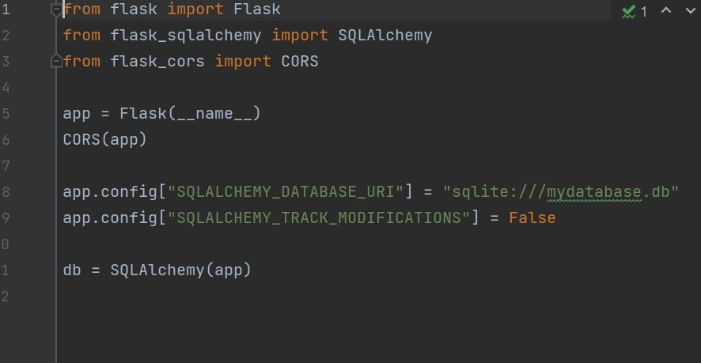
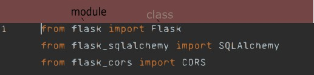
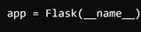

` crud` Create read update delete

`CORS`  Cross Origin Resource Sharing
### In this image

1- Imports the flask 
class from the flask module



"The `Flask` class is used to
create an instance of a Flask 
application."

2- imports the `SQLAlchemy` 
class from the `flask_sqlalchemy` module

"`Flask-SQLAlchemy` is an extension for 
Flask that adds support for SQLAlchemy, 
a SQL toolkit and Object-Relational Mapping (ORM) 
system for Python.
The SQLAlchemy class is used to interact with the 
database and perform operations such as querying, 
inserting, updating, and deleting data."

3- "This line imports the `CORS` class from the `flask_cors` module. `Flask-CORS` is an extension for Flask that handles Cross-Origin Resource Sharing (CORS), making it possible to make cross-origin AJAX requests.
  - The `CORS` class is used to enable CORS support in the Flask application, allowing resources to be accessed from different domains."

5- This how you initialize an instance of a flask app using the `Flask` class
and assign it as a value to 
a variable which is `app` in this case.



`__name__` is a kind of "variable in Python which is set to the name of the module in which it is used.
When a script is run directly, `__name__` is set to `'__main__'`"
"The Flask instance `app` is the central object of the application, and it will be used to configure the app and register routes"

6- `CORS(app)`
Enables CORS (Cross Origin Resourse sharing) for the entire app.
Here `CORS` is the class that was imported and the argument is the
 `app` varable. As you know from line 5 `app` is the flask app instance 
`Flask(__name__)`
 
8-
A configuration variable of the flask app is being set to the URI of the database. `SQLALCHEMY_DATABASE_URI` is a key 
in the app's configuration dictionary and we are using it to specify the location and type of database. Flask SQLAlchemy 
will determine the type and location of the database using this key.

As you can see the path to a sqlite database is being passed as a
 string. In this URI you can see the type of database which is 
sqlite and the rest of the path will include the name.

9- Another app configuration key takes in a boolean as a value

This is clearly setting the `["SQLALCHEMY_TRACK_MODIFICATIONS"]` 
to `False`

11- `db = SQLAlchemy(app)`
An instance of sqlalchemy being initialised 
with the flask app instance `app` and assigned to the 
variable `db`
### Models
In the last line of the **configuration module** `config.py` an instance of the `SQLAlchemy` class was created 
```python
from config import db
```